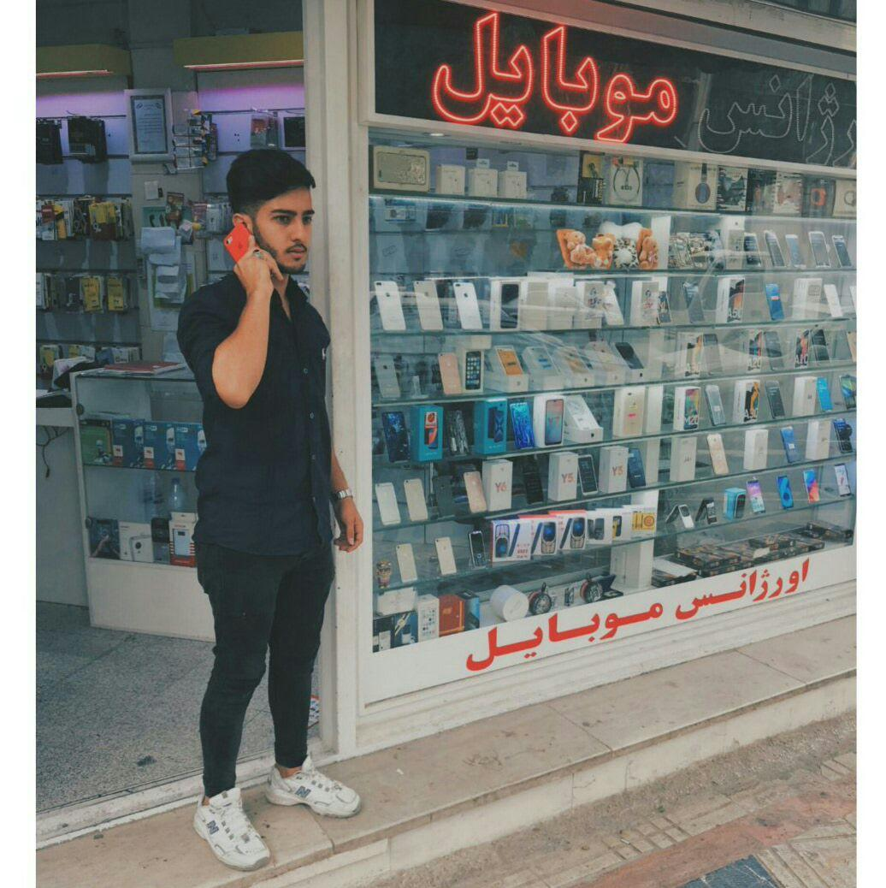

<h1>Mohamad Mahdi Akbari</h1>

Mobile-Repairman

### Personal Information :
+ Age: 20
+ Gender: Male 
+ Location: Shahre ghods
+ Marital Status: Single
+ Military Service Status:Educational Exemption

---
### Education : 
Bachelor Software engineeringShahriar PNU 

### Work Experience :
+Mobile & Tablet work repair:
-Two years of shop experience in the field of professional mobile repairs and mobilesales.
-Has a valid international technical degree in mobile phone repair.
-Fluent in searching and typing fast.
-Familiarity with the field of repairing and replacing computer and lip components.
+Other:
-Familiarity with different types of Word, Exel , Power Point and other applications.

---
### Training Courses :
+Mobile Repairs:
-Professional technical organizationIran

---
### Language :
+Persian (100%)
+English (90%)
+Deusch (50%)

---
### Software Skills:

+ Word (100 % )
+ PowerPoint  ( 100 % )
+ Android (100 % )
+ ios (100 %)
+ C & C++ (80 %)
Additional Skills:
+ Windows replacementodin & Sp flashtoolsZ3X & Octopus Mobile flash boxes &....

---
### Contact Details :

+ Phone: +989033122896
+ Mail: sh.akbari780@gmail.com
+ Website & applications:
Telegram: t.me/crzboy
Instagram: @crzking
